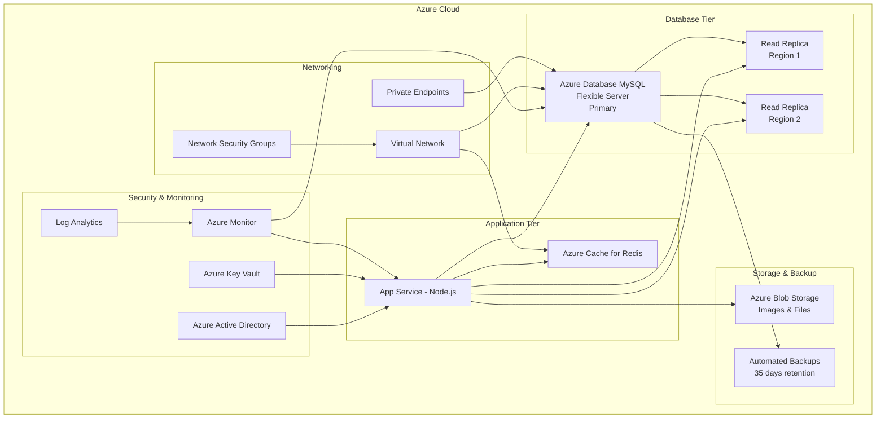
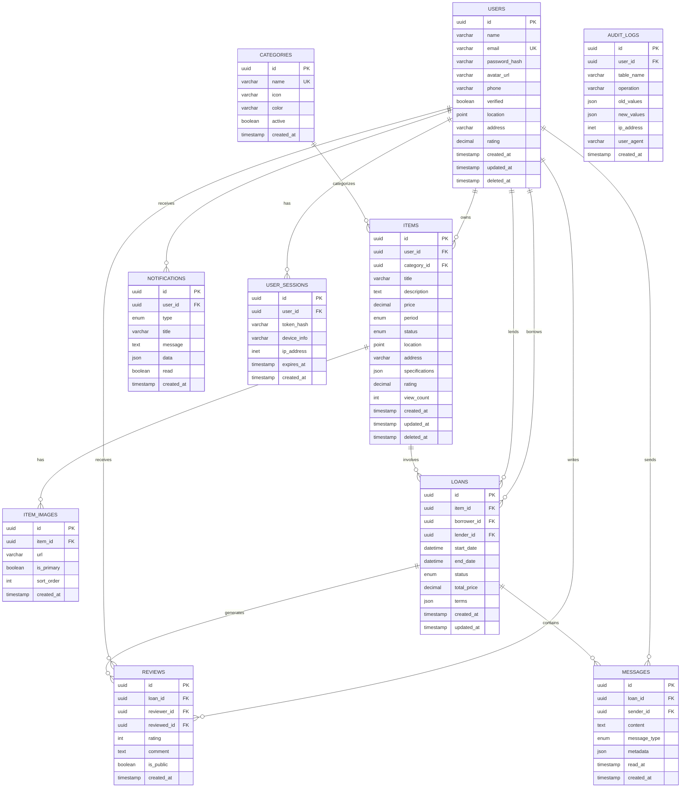

# Design da Modernização do Banco de Dados para Azure - Empresta aê

## Overview

Este documento apresenta o design completo para modernizar a infraestrutura de
banco de dados do aplicativo "Em" utilizando os serviços Azure. A solução
proposta migra de um MySQL tradicional para uma arquitetura cloud-native
robusta, escalável e segura, utilizando Azure Database for MySQL Flexible Server
como componente principal.

A arquitetura foi projetada para suportar o crescimento do aplicativo,
garantindo alta disponibilidade, performance otimizada e conformidade com
regulamentações como LGPD, enquanto mantém custos operacionais controlados
através de auto-scaling inteligente.

## Architecture

### Arquitetura Geral



### Arquitetura de Dados



## Components and Interfaces

### 1. Azure Database for MySQL Flexible Server

**Configuração Principal:**

- **Tier:** General Purpose
- **Compute:** Standard_D4ds_v4 (4 vCores, 16GB RAM)
- **Storage:** 512GB Premium SSD com auto-growth
- **Backup:** 35 dias de retenção com geo-redundância
- **High Availability:** Zone-redundant HA habilitado

**Configurações de Segurança:**

```sql
-- SSL/TLS obrigatório
SET GLOBAL require_secure_transport = ON;

-- Configurações de conexão
SET GLOBAL max_connections = 1000;
SET GLOBAL max_user_connections = 50;
SET GLOBAL connect_timeout = 10;
SET GLOBAL wait_timeout = 28800;
```

### 2. Schema de Banco Otimizado

**Tabela Users (Modernizada):**

```sql
CREATE TABLE users (
    id CHAR(36) PRIMARY KEY DEFAULT (UUID()),
    name VARCHAR(100) NOT NULL,
    email VARCHAR(100) NOT NULL UNIQUE,
    password_hash VARCHAR(255) NOT NULL,
    avatar_url VARCHAR(500),
    phone VARCHAR(20),
    verified BOOLEAN DEFAULT FALSE,
    location POINT SRID 4326,
    address VARCHAR(500),
    rating DECIMAL(3,2) DEFAULT 0.00,
    created_at TIMESTAMP DEFAULT CURRENT_TIMESTAMP,
    updated_at TIMESTAMP DEFAULT CURRENT_TIMESTAMP ON UPDATE CURRENT_TIMESTAMP,
    deleted_at TIMESTAMP NULL,

    INDEX idx_email (email),
    INDEX idx_verified (verified),
    INDEX idx_location (location),
    INDEX idx_rating (rating),
    INDEX idx_created_at (created_at),
    SPATIAL INDEX idx_spatial_location (location)
) ENGINE=InnoDB DEFAULT CHARSET=utf8mb4 COLLATE=utf8mb4_unicode_ci;
```

**Tabela Items (Otimizada):**

```sql
CREATE TABLE items (
    id CHAR(36) PRIMARY KEY DEFAULT (UUID()),
    user_id CHAR(36) NOT NULL,
    category_id CHAR(36) NOT NULL,
    title VARCHAR(200) NOT NULL,
    description TEXT,
    price DECIMAL(10,2),
    period ENUM('hora', 'dia', 'semana', 'mes'),
    status ENUM('available', 'borrowed', 'unavailable') DEFAULT 'available',
    location POINT SRID 4326,
    address VARCHAR(500),
    specifications JSON,
    rating DECIMAL(3,2) DEFAULT 0.00,
    view_count INT DEFAULT 0,
    created_at TIMESTAMP DEFAULT CURRENT_TIMESTAMP,
    updated_at TIMESTAMP DEFAULT CURRENT_TIMESTAMP ON UPDATE CURRENT_TIMESTAMP,
    deleted_at TIMESTAMP NULL,

    FOREIGN KEY (user_id) REFERENCES users(id) ON DELETE CASCADE,
    FOREIGN KEY (category_id) REFERENCES categories(id) ON DELETE RESTRICT,

    INDEX idx_user_id (user_id),
    INDEX idx_category_id (category_id),
    INDEX idx_status (status),
    INDEX idx_price (price),
    INDEX idx_period (period),
    INDEX idx_rating (rating),
    INDEX idx_created_at (created_at),
    SPATIAL INDEX idx_spatial_location (location),
    FULLTEXT INDEX idx_search (title, description)
) ENGINE=InnoDB DEFAULT CHARSET=utf8mb4 COLLATE=utf8mb4_unicode_ci;
```

### 3. Connection Pool e Cache Strategy

**Configuração do Pool de Conexões (Node.js):**

```javascript
const mysql = require('mysql2/promise');

const poolConfig = {
  host: process.env.AZURE_MYSQL_HOST,
  port: 3306,
  user: process.env.AZURE_MYSQL_USER,
  password: process.env.AZURE_MYSQL_PASSWORD,
  database: process.env.AZURE_MYSQL_DATABASE,
  ssl: {
    rejectUnauthorized: true,
  },
  connectionLimit: 20,
  acquireTimeout: 60000,
  timeout: 60000,
  reconnect: true,
  charset: 'utf8mb4',
};

const pool = mysql.createPool(poolConfig);
```

**Cache Strategy com Redis:**

```javascript
const redis = require('redis');

const cacheConfig = {
  host: process.env.AZURE_REDIS_HOST,
  port: 6380,
  password: process.env.AZURE_REDIS_KEY,
  tls: true,
  retryDelayOnFailover: 100,
  maxRetriesPerRequest: 3,
};

// Cache patterns
const CACHE_KEYS = {
  USER: (id) => `user:${id}`,
  ITEM: (id) => `item:${id}`,
  ITEMS_BY_LOCATION: (lat, lng, radius) => `items:geo:${lat}:${lng}:${radius}`,
  CATEGORIES: 'categories:all',
};
```

### 4. Read Replicas Configuration

**Primary-Replica Setup:**

```sql
-- Configuração no servidor primário
SET GLOBAL read_only = OFF;
SET GLOBAL super_read_only = OFF;

-- Configuração nas réplicas
SET GLOBAL read_only = ON;
SET GLOBAL super_read_only = ON;
```

**Load Balancing Strategy:**

```javascript
class DatabaseManager {
  constructor() {
    this.primaryPool = createPool(primaryConfig);
    this.replicaPools = [
      createPool(replica1Config),
      createPool(replica2Config),
    ];
  }

  async executeRead(query, params) {
    const replica = this.getHealthyReplica();
    return replica.execute(query, params);
  }

  async executeWrite(query, params) {
    return this.primaryPool.execute(query, params);
  }

  getHealthyReplica() {
    // Round-robin com health check
    return this.replicaPools[
      this.currentReplicaIndex++ % this.replicaPools.length
    ];
  }
}
```

## Data Models

### User Model

```typescript
interface User {
  id: string;
  name: string;
  email: string;
  passwordHash: string;
  avatarUrl?: string;
  phone?: string;
  verified: boolean;
  location?: {
    latitude: number;
    longitude: number;
  };
  address?: string;
  rating: number;
  createdAt: Date;
  updatedAt: Date;
  deletedAt?: Date;
}
```

### Item Model

```typescript
interface Item {
  id: string;
  userId: string;
  categoryId: string;
  title: string;
  description?: string;
  price?: number;
  period?: 'hora' | 'dia' | 'semana' | 'mes';
  status: 'available' | 'borrowed' | 'unavailable';
  location?: {
    latitude: number;
    longitude: number;
  };
  address?: string;
  specifications?: Record<string, any>;
  rating: number;
  viewCount: number;
  createdAt: Date;
  updatedAt: Date;
  deletedAt?: Date;
}
```

### Geospatial Queries

```sql
-- Buscar itens por proximidade (raio em metros)
SELECT
    i.*,
    ST_Distance_Sphere(i.location, POINT(?, ?)) as distance
FROM items i
WHERE ST_Distance_Sphere(i.location, POINT(?, ?)) <= ?
    AND i.status = 'available'
    AND i.deleted_at IS NULL
ORDER BY distance
LIMIT ? OFFSET ?;

-- Índice espacial otimizado
CREATE SPATIAL INDEX idx_items_location ON items(location);
```

## Error Handling

### Database Error Handling Strategy

```javascript
class DatabaseError extends Error {
  constructor(message, code, query, params) {
    super(message);
    this.name = 'DatabaseError';
    this.code = code;
    this.query = query;
    this.params = params;
    this.timestamp = new Date().toISOString();
  }
}

class DatabaseService {
  async executeQuery(query, params) {
    try {
      return await this.pool.execute(query, params);
    } catch (error) {
      // Log para Azure Monitor
      this.logger.error('Database query failed', {
        error: error.message,
        code: error.code,
        query: query,
        params: params,
        timestamp: new Date().toISOString(),
      });

      // Tratamento específico por tipo de erro
      switch (error.code) {
        case 'ER_DUP_ENTRY':
          throw new DatabaseError(
            'Duplicate entry',
            'DUPLICATE',
            query,
            params
          );
        case 'ER_NO_REFERENCED_ROW_2':
          throw new DatabaseError(
            'Foreign key constraint',
            'FK_VIOLATION',
            query,
            params
          );
        case 'ECONNREFUSED':
          throw new DatabaseError(
            'Connection refused',
            'CONNECTION_ERROR',
            query,
            params
          );
        default:
          throw new DatabaseError(error.message, error.code, query, params);
      }
    }
  }
}
```

### Circuit Breaker Pattern

```javascript
class CircuitBreaker {
  constructor(threshold = 5, timeout = 60000) {
    this.failureThreshold = threshold;
    this.timeout = timeout;
    this.failureCount = 0;
    this.lastFailureTime = null;
    this.state = 'CLOSED'; // CLOSED, OPEN, HALF_OPEN
  }

  async execute(operation) {
    if (this.state === 'OPEN') {
      if (Date.now() - this.lastFailureTime > this.timeout) {
        this.state = 'HALF_OPEN';
      } else {
        throw new Error('Circuit breaker is OPEN');
      }
    }

    try {
      const result = await operation();
      this.onSuccess();
      return result;
    } catch (error) {
      this.onFailure();
      throw error;
    }
  }

  onSuccess() {
    this.failureCount = 0;
    this.state = 'CLOSED';
  }

  onFailure() {
    this.failureCount++;
    this.lastFailureTime = Date.now();

    if (this.failureCount >= this.failureThreshold) {
      this.state = 'OPEN';
    }
  }
}
```

## Testing Strategy

### Database Testing Framework

```javascript
// Test setup com container MySQL
const { GenericContainer } = require('testcontainers');

class DatabaseTestSetup {
  static async setup() {
    const container = await new GenericContainer('mysql:8.0')
      .withEnvironment({
        MYSQL_ROOT_PASSWORD: 'test',
        MYSQL_DATABASE: 'empresta_ae_test',
      })
      .withExposedPorts(3306)
      .start();

    const config = {
      host: container.getHost(),
      port: container.getMappedPort(3306),
      user: 'root',
      password: 'test',
      database: 'empresta_ae_test',
    };

    // Executar migrations
    await this.runMigrations(config);

    return { container, config };
  }

  static async teardown(container) {
    await container.stop();
  }
}

// Testes de performance
describe('Database Performance Tests', () => {
  test('should handle 1000 concurrent reads', async () => {
    const promises = Array(1000)
      .fill()
      .map(() => itemService.getItems({ page: 1, limit: 10 }));

    const start = Date.now();
    await Promise.all(promises);
    const duration = Date.now() - start;

    expect(duration).toBeLessThan(5000); // 5 segundos max
  });

  test('geospatial queries should be fast', async () => {
    const start = Date.now();
    const items = await itemService.getItemsByLocation({
      latitude: -23.5505,
      longitude: -46.6333,
      radius: 5000,
    });
    const duration = Date.now() - start;

    expect(duration).toBeLessThan(100); // 100ms max
    expect(items).toBeDefined();
  });
});
```

### Migration Testing

```javascript
// Teste de migração com rollback
describe('Migration Tests', () => {
  test('should migrate and rollback successfully', async () => {
    const migrator = new DatabaseMigrator(testConfig);

    // Estado inicial
    const initialVersion = await migrator.getCurrentVersion();

    // Executar migração
    await migrator.migrate();
    const newVersion = await migrator.getCurrentVersion();
    expect(newVersion).toBeGreaterThan(initialVersion);

    // Rollback
    await migrator.rollback();
    const rolledBackVersion = await migrator.getCurrentVersion();
    expect(rolledBackVersion).toBe(initialVersion);
  });
});
```

## Security Implementation

### Azure AD Integration

```javascript
const { DefaultAzureCredential } = require('@azure/identity');
const { SecretClient } = require('@azure/keyvault-secrets');

class SecurityManager {
  constructor() {
    this.credential = new DefaultAzureCredential();
    this.keyVaultClient = new SecretClient(
      process.env.AZURE_KEYVAULT_URL,
      this.credential
    );
  }

  async getDatabaseCredentials() {
    const [host, user, password] = await Promise.all([
      this.keyVaultClient.getSecret('mysql-host'),
      this.keyVaultClient.getSecret('mysql-user'),
      this.keyVaultClient.getSecret('mysql-password'),
    ]);

    return {
      host: host.value,
      user: user.value,
      password: password.value,
    };
  }
}
```

### Data Encryption

```sql
-- Criptografia em repouso (configuração do servidor)
SET GLOBAL innodb_encrypt_tables = ON;
SET GLOBAL innodb_encrypt_log = ON;
SET GLOBAL innodb_encrypt_temporary_tables = ON;

-- Criptografia de campos sensíveis
CREATE TABLE users (
    -- ... outros campos
    encrypted_data JSON,
    -- Usar AES_ENCRYPT/AES_DECRYPT para dados sensíveis
    phone_encrypted VARBINARY(255) AS (AES_ENCRYPT(phone, UNHEX(SHA2('encryption_key', 256)))) STORED
);
```

### Audit Logging

```sql
CREATE TABLE audit_logs (
    id CHAR(36) PRIMARY KEY DEFAULT (UUID()),
    user_id CHAR(36),
    table_name VARCHAR(64) NOT NULL,
    operation ENUM('INSERT', 'UPDATE', 'DELETE') NOT NULL,
    old_values JSON,
    new_values JSON,
    ip_address INET6,
    user_agent TEXT,
    created_at TIMESTAMP DEFAULT CURRENT_TIMESTAMP,

    INDEX idx_user_id (user_id),
    INDEX idx_table_operation (table_name, operation),
    INDEX idx_created_at (created_at)
) ENGINE=InnoDB DEFAULT CHARSET=utf8mb4 COLLATE=utf8mb4_unicode_ci;

-- Triggers para auditoria automática
DELIMITER $$
CREATE TRIGGER users_audit_insert
AFTER INSERT ON users
FOR EACH ROW
BEGIN
    INSERT INTO audit_logs (user_id, table_name, operation, new_values)
    VALUES (NEW.id, 'users', 'INSERT', JSON_OBJECT(
        'id', NEW.id,
        'name', NEW.name,
        'email', NEW.email
    ));
END$$
DELIMITER ;
```
