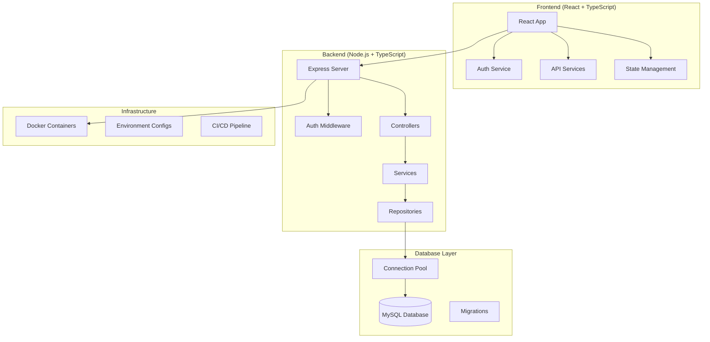

# Design Document

## Overview

Este documento detalha o design técnico para transformar o "Empresta aê" em uma
aplicaçãofissional pronta para produção. A solução manterá o frontend React
existente enquanto implementa um backend Node.js robusto, sistema de
autenticação real, integração com banco de dados SQL e todas as melhores
práticas necessárias para um ambiente de produção.

## Architecture

### High-Level Architecture



### Project Structure

```
empresta-ae-production/
├── frontend/                    # React application (existing code moved here)
│   ├── src/
│   ├── public/
│   ├── package.json
│   └── vite.config.ts
├── backend/                     # New Node.js backend
│   ├── src/
│   │   ├── controllers/         # Route handlers
│   │   ├── services/           # Business logic
│   │   ├── repositories/       # Data access layer
│   │   ├── middleware/         # Express middleware
│   │   ├── models/             # Data models and types
│   │   ├── utils/              # Utility functions
│   │   ├── config/             # Configuration files
│   │   └── app.ts              # Express app setup
│   ├── tests/                  # Backend tests
│   ├── migrations/             # Database migrations
│   ├── seeds/                  # Database seeders
│   └── package.json
├── shared/                     # Shared types and utilities
│   └── types/                  # TypeScript interfaces
├── docker/                     # Docker configurations
│   ├── Dockerfile.frontend
│   ├── Dockerfile.backend
│   └── docker-compose.yml
├── docs/                       # Documentation
├── scripts/                    # Build and deployment scripts
└── README.md
```

## Components and Interfaces

### Backend Architecture

#### 1. Express Server Setup

```typescript
// app.ts structure
interface AppConfig {
  port: number;
  cors: CorsOptions;
  database: DatabaseConfig;
  jwt: JWTConfig;
}

class App {
  private express: Express;
  private config: AppConfig;

  constructor(config: AppConfig);
  setupMiddleware(): void;
  setupRoutes(): void;
  setupErrorHandling(): void;
  start(): Promise<void>;
}
```

#### 2. Authentication System

```typescript
interface AuthService {
  register(userData: RegisterData): Promise<AuthResponse>;
  login(credentials: LoginData): Promise<AuthResponse>;
  refreshToken(token: string): Promise<AuthResponse>;
  logout(userId: string): Promise<void>;
  validateToken(token: string): Promise<User>;
}

interface AuthMiddleware {
  authenticate(req: Request, res: Response, next: NextFunction): void;
  authorize(roles: string[]): MiddlewareFunction;
}
```

#### 3. Database Layer

```typescript
interface Repository<T> {
  create(data: Partial<T>): Promise<T>;
  findById(id: string): Promise<T | null>;
  findMany(filters: FilterOptions): Promise<T[]>;
  update(id: string, data: Partial<T>): Promise<T>;
  delete(id: string): Promise<void>;
}

interface DatabaseConnection {
  pool: mysql.Pool;
  transaction<T>(
    callback: (connection: mysql.Connection) => Promise<T>
  ): Promise<T>;
  query<T>(sql: string, params?: any[]): Promise<T>;
}
```

#### 4. API Controllers Structure

```typescript
interface BaseController {
  handleRequest(req: Request, res: Response, next: NextFunction): Promise<void>;
  validateInput(schema: ZodSchema): MiddlewareFunction;
  handleError(error: Error, res: Response): void;
}

// Example: ItemsController
class ItemsController extends BaseController {
  constructor(private itemsService: ItemsService);

  getItems: RequestHandler;
  getItem: RequestHandler;
  createItem: RequestHandler;
  updateItem: RequestHandler;
  deleteItem: RequestHandler;
}
```

### Frontend Integration

#### 1. API Service Layer

```typescript
interface ApiService {
  baseURL: string;
  token?: string;

  get<T>(endpoint: string, params?: object): Promise<T>;
  post<T>(endpoint: string, data?: object): Promise<T>;
  put<T>(endpoint: string, data?: object): Promise<T>;
  delete<T>(endpoint: string): Promise<T>;
}

interface AuthApiService extends ApiService {
  login(credentials: LoginData): Promise<AuthResponse>;
  register(userData: RegisterData): Promise<AuthResponse>;
  refreshToken(): Promise<AuthResponse>;
  logout(): Promise<void>;
}
```

#### 2. State Management Updates

```typescript
interface AuthStore {
  user: User | null;
  token: string | null;
  isLoading: boolean;
  error: string | null;

  login: (credentials: LoginData) => Promise<void>;
  register: (userData: RegisterData) => Promise<void>;
  logout: () => void;
  refreshToken: () => Promise<void>;
}

interface ItemsStore {
  items: Item[];
  currentItem: Item | null;
  isLoading: boolean;
  error: string | null;

  fetchItems: (filters?: FilterOptions) => Promise<void>;
  fetchItem: (id: string) => Promise<void>;
  createItem: (data: CreateItemData) => Promise<void>;
  updateItem: (id: string, data: UpdateItemData) => Promise<void>;
  deleteItem: (id: string) => Promise<void>;
}
```

## Data Models

### Database Schema

#### Users Table

```sql
CREATE TABLE users (
  id VARCHAR(36) PRIMARY KEY DEFAULT (UUID()),
  email VARCHAR(255) UNIQUE NOT NULL,
  password_hash VARCHAR(255) NOT NULL,
  first_name VARCHAR(100) NOT NULL,
  last_name VARCHAR(100) NOT NULL,
  phone VARCHAR(20),
  avatar_url VARCHAR(500),
  location_lat DECIMAL(10, 8),
  location_lng DECIMAL(11, 8),
  location_address TEXT,
  email_verified BOOLEAN DEFAULT FALSE,
  is_active BOOLEAN DEFAULT TRUE,
  created_at TIMESTAMP DEFAULT CURRENT_TIMESTAMP,
  updated_at TIMESTAMP DEFAULT CURRENT_TIMESTAMP ON UPDATE CURRENT_TIMESTAMP,

  INDEX idx_email (email),
  INDEX idx_location (location_lat, location_lng)
);
```

#### Items Table (Enhanced)

```sql
CREATE TABLE items (
  id VARCHAR(36) PRIMARY KEY DEFAULT (UUID()),
  owner_id VARCHAR(36) NOT NULL,
  title VARCHAR(200) NOT NULL,
  description TEXT,
  category_id VARCHAR(36) NOT NULL,
  price DECIMAL(10, 2) NOT NULL,
  period ENUM('hour', 'day', 'week', 'month') NOT NULL,
  status ENUM('available', 'rented', 'maintenance', 'inactive') DEFAULT 'available',
  location_lat DECIMAL(10, 8),
  location_lng DECIMAL(11, 8),
  location_address TEXT,
  created_at TIMESTAMP DEFAULT CURRENT_TIMESTAMP,
  updated_at TIMESTAMP DEFAULT CURRENT_TIMESTAMP ON UPDATE CURRENT_TIMESTAMP,

  FOREIGN KEY (owner_id) REFERENCES users(id) ON DELETE CASCADE,
  FOREIGN KEY (category_id) REFERENCES categories(id),
  INDEX idx_owner (owner_id),
  INDEX idx_category (category_id),
  INDEX idx_status (status),
  INDEX idx_location (location_lat, location_lng),
  FULLTEXT idx_search (title, description)
);
```

#### Authentication Tokens Table

```sql
CREATE TABLE refresh_tokens (
  id VARCHAR(36) PRIMARY KEY DEFAULT (UUID()),
  user_id VARCHAR(36) NOT NULL,
  token_hash VARCHAR(255) NOT NULL,
  expires_at TIMESTAMP NOT NULL,
  created_at TIMESTAMP DEFAULT CURRENT_TIMESTAMP,

  FOREIGN KEY (user_id) REFERENCES users(id) ON DELETE CASCADE,
  INDEX idx_user (user_id),
  INDEX idx_expires (expires_at)
);
```

### TypeScript Interfaces

#### Shared Types

```typescript
// shared/types/auth.ts
export interface User {
  id: string;
  email: string;
  firstName: string;
  lastName: string;
  phone?: string;
  avatarUrl?: string;
  location?: {
    latitude: number;
    longitude: number;
    address: string;
  };
  emailVerified: boolean;
  isActive: boolean;
  createdAt: string;
  updatedAt: string;
}

export interface AuthResponse {
  user: User;
  accessToken: string;
  refreshToken: string;
  expiresIn: number;
}

export interface LoginData {
  email: string;
  password: string;
}

export interface RegisterData {
  email: string;
  password: string;
  firstName: string;
  lastName: string;
  phone?: string;
}
```

#### API Response Types

```typescript
// shared/types/api.ts
export interface ApiResponse<T> {
  success: boolean;
  data: T;
  message?: string;
}

export interface ApiError {
  success: false;
  error: {
    code: string;
    message: string;
    details?: any;
  };
}

export interface PaginatedResponse<T> {
  data: T[];
  pagination: {
    page: number;
    limit: number;
    total: number;
    totalPages: number;
  };
}
```

## Error Handling

### Backend Error Handling Strategy

#### 1. Error Types

```typescript
abstract class AppError extends Error {
  abstract statusCode: number;
  abstract isOperational: boolean;

  constructor(
    message: string,
    public context?: any
  ) {
    super(message);
    Error.captureStackTrace(this, this.constructor);
  }
}

class ValidationError extends AppError {
  statusCode = 400;
  isOperational = true;
}

class AuthenticationError extends AppError {
  statusCode = 401;
  isOperational = true;
}

class AuthorizationError extends AppError {
  statusCode = 403;
  isOperational = true;
}

class NotFoundError extends AppError {
  statusCode = 404;
  isOperational = true;
}
```

#### 2. Global Error Handler

```typescript
interface ErrorHandler {
  handleError(
    error: Error,
    req: Request,
    res: Response,
    next: NextFunction
  ): void;
  logError(error: Error, req: Request): void;
  isOperationalError(error: Error): boolean;
}

class GlobalErrorHandler implements ErrorHandler {
  handleError(
    error: Error,
    req: Request,
    res: Response,
    next: NextFunction
  ): void {
    this.logError(error, req);

    if (error instanceof AppError) {
      return res.status(error.statusCode).json({
        success: false,
        error: {
          code: error.constructor.name,
          message: error.message,
          ...(process.env.NODE_ENV === 'development' && { stack: error.stack }),
        },
      });
    }

    // Handle unexpected errors
    res.status(500).json({
      success: false,
      error: {
        code: 'INTERNAL_SERVER_ERROR',
        message: 'Something went wrong',
      },
    });
  }
}
```

### Frontend Error Handling

#### 1. API Error Interceptor

```typescript
class ApiErrorHandler {
  static handleApiError(error: AxiosError): never {
    if (error.response?.status === 401) {
      // Handle authentication errors
      authStore.logout();
      window.location.href = '/auth';
    }

    if (error.response?.status === 403) {
      // Handle authorization errors
      throw new Error('Você não tem permissão para esta ação');
    }

    if (error.response?.status >= 500) {
      // Handle server errors
      throw new Error('Erro interno do servidor. Tente novamente mais tarde.');
    }

    // Handle other errors
    const message = error.response?.data?.error?.message || 'Erro desconhecido';
    throw new Error(message);
  }
}
```

#### 2. React Error Boundaries

```typescript
interface ErrorBoundaryState {
  hasError: boolean;
  error?: Error;
}

class ErrorBoundary extends Component<PropsWithChildren, ErrorBoundaryState> {
  constructor(props: PropsWithChildren) {
    super(props);
    this.state = { hasError: false };
  }

  static getDerivedStateFromError(error: Error): ErrorBoundaryState {
    return { hasError: true, error };
  }

  componentDidCatch(error: Error, errorInfo: ErrorInfo) {
    console.error('Error caught by boundary:', error, errorInfo);
    // Send to error reporting service
  }

  render() {
    if (this.state.hasError) {
      return <ErrorFallback error={this.state.error} />;
    }

    return this.props.children;
  }
}
```

## Testing Strategy

### Backend Testing

#### 1. Unit Tests

```typescript
// Example: AuthService unit test
describe('AuthService', () => {
  let authService: AuthService;
  let mockUserRepository: jest.Mocked<UserRepository>;
  let mockTokenService: jest.Mocked<TokenService>;

  beforeEach(() => {
    mockUserRepository = createMockUserRepository();
    mockTokenService = createMockTokenService();
    authService = new AuthService(mockUserRepository, mockTokenService);
  });

  describe('login', () => {
    it('should return auth response for valid credentials', async () => {
      // Test implementation
    });

    it('should throw AuthenticationError for invalid credentials', async () => {
      // Test implementation
    });
  });
});
```

#### 2. Integration Tests

```typescript
// Example: API integration test
describe('POST /api/auth/login', () => {
  let app: Express;
  let testDb: TestDatabase;

  beforeAll(async () => {
    testDb = await setupTestDatabase();
    app = createTestApp(testDb.config);
  });

  afterAll(async () => {
    await testDb.cleanup();
  });

  it('should login user with valid credentials', async () => {
    const userData = await testDb.createUser({
      email: 'test@example.com',
      password: 'password123',
    });

    const response = await request(app)
      .post('/api/auth/login')
      .send({
        email: 'test@example.com',
        password: 'password123',
      })
      .expect(200);

    expect(response.body.success).toBe(true);
    expect(response.body.data.accessToken).toBeDefined();
  });
});
```

### Frontend Testing

#### 1. Component Tests

```typescript
// Example: Login component test
describe('LoginForm', () => {
  it('should submit form with valid data', async () => {
    const mockOnLogin = jest.fn();
    render(<LoginForm onLogin={mockOnLogin} />);

    await user.type(screen.getByLabelText(/email/i), 'test@example.com');
    await user.type(screen.getByLabelText(/password/i), 'password123');
    await user.click(screen.getByRole('button', { name: /entrar/i }));

    expect(mockOnLogin).toHaveBeenCalledWith({
      email: 'test@example.com',
      password: 'password123'
    });
  });
});
```

#### 2. E2E Tests

```typescript
// Example: Cypress E2E test
describe('Authentication Flow', () => {
  it('should allow user to login and access protected pages', () => {
    cy.visit('/auth');
    cy.get('[data-testid="email-input"]').type('test@example.com');
    cy.get('[data-testid="password-input"]').type('password123');
    cy.get('[data-testid="login-button"]').click();

    cy.url().should('eq', Cypress.config().baseUrl + '/');
    cy.get('[data-testid="user-menu"]').should('be.visible');
  });
});
```

## Security Implementation

### Authentication & Authorization

#### 1. JWT Implementation

```typescript
interface JWTService {
  generateAccessToken(payload: JWTPayload): string;
  generateRefreshToken(userId: string): Promise<string>;
  verifyAccessToken(token: string): JWTPayload;
  verifyRefreshToken(token: string): Promise<string>; // returns userId
  revokeRefreshToken(token: string): Promise<void>;
}

interface JWTPayload {
  userId: string;
  email: string;
  iat: number;
  exp: number;
}
```

#### 2. Password Security

```typescript
interface PasswordService {
  hash(password: string): Promise<string>;
  verify(password: string, hash: string): Promise<boolean>;
  validateStrength(password: string): ValidationResult;
}

class BcryptPasswordService implements PasswordService {
  private readonly saltRounds = 12;

  async hash(password: string): Promise<string> {
    return bcrypt.hash(password, this.saltRounds);
  }

  async verify(password: string, hash: string): Promise<boolean> {
    return bcrypt.compare(password, hash);
  }
}
```

### Input Validation & Sanitization

#### 1. Validation Schemas

```typescript
// Using Zod for validation
const registerSchema = z.object({
  email: z.string().email('Email inválido'),
  password: z
    .string()
    .min(8, 'Senha deve ter pelo menos 8 caracteres')
    .regex(
      /^(?=.*[a-z])(?=.*[A-Z])(?=.*\d)/,
      'Senha deve conter maiúscula, minúscula e número'
    ),
  firstName: z.string().min(2, 'Nome deve ter pelo menos 2 caracteres'),
  lastName: z.string().min(2, 'Sobrenome deve ter pelo menos 2 caracteres'),
  phone: z.string().optional(),
});

const createItemSchema = z.object({
  title: z.string().min(3).max(200),
  description: z.string().max(2000),
  price: z.number().positive(),
  period: z.enum(['hour', 'day', 'week', 'month']),
  categoryId: z.string().uuid(),
  location: z.object({
    latitude: z.number(),
    longitude: z.number(),
    address: z.string(),
  }),
});
```

#### 2. Sanitization Middleware

```typescript
interface SanitizationService {
  sanitizeHtml(input: string): string;
  sanitizeString(input: string): string;
  validateFileUpload(file: Express.Multer.File): ValidationResult;
}

class DOMPurifySanitizationService implements SanitizationService {
  sanitizeHtml(input: string): string {
    return DOMPurify.sanitize(input);
  }

  sanitizeString(input: string): string {
    return input.trim().replace(/[<>]/g, '');
  }
}
```

### Rate Limiting & Security Headers

#### 1. Rate Limiting Configuration

```typescript
const rateLimitConfig = {
  auth: {
    windowMs: 15 * 60 * 1000, // 15 minutes
    max: 5, // 5 attempts per window
    message: 'Muitas tentativas de login. Tente novamente em 15 minutos.',
  },
  api: {
    windowMs: 15 * 60 * 1000,
    max: 100, // 100 requests per window
    message: 'Muitas requisições. Tente novamente mais tarde.',
  },
};
```

#### 2. Security Headers

```typescript
const securityConfig = {
  helmet: {
    contentSecurityPolicy: {
      directives: {
        defaultSrc: ["'self'"],
        styleSrc: ["'self'", "'unsafe-inline'", 'https://fonts.googleapis.com'],
        fontSrc: ["'self'", 'https://fonts.gstatic.com'],
        imgSrc: ["'self'", 'data:', 'https:'],
        scriptSrc: ["'self'"],
        connectSrc: ["'self'", process.env.API_URL],
      },
    },
    hsts: {
      maxAge: 31536000,
      includeSubDomains: true,
      preload: true,
    },
  },
};
```

## Performance Optimization

### Backend Performance

#### 1. Database Optimization

```typescript
interface DatabaseOptimization {
  connectionPool: {
    min: number;
    max: number;
    acquireTimeoutMillis: number;
    idleTimeoutMillis: number;
  };
  queryOptimization: {
    useIndexes: boolean;
    enableQueryCache: boolean;
    slowQueryThreshold: number;
  };
}

const dbConfig: DatabaseOptimization = {
  connectionPool: {
    min: 2,
    max: 10,
    acquireTimeoutMillis: 30000,
    idleTimeoutMillis: 600000,
  },
  queryOptimization: {
    useIndexes: true,
    enableQueryCache: true,
    slowQueryThreshold: 1000, // 1 second
  },
};
```

#### 2. Caching Strategy

```typescript
interface CacheService {
  get<T>(key: string): Promise<T | null>;
  set<T>(key: string, value: T, ttl?: number): Promise<void>;
  delete(key: string): Promise<void>;
  clear(): Promise<void>;
}

class RedisCacheService implements CacheService {
  constructor(private redis: Redis) {}

  async get<T>(key: string): Promise<T | null> {
    const value = await this.redis.get(key);
    return value ? JSON.parse(value) : null;
  }

  async set<T>(key: string, value: T, ttl = 3600): Promise<void> {
    await this.redis.setex(key, ttl, JSON.stringify(value));
  }
}
```

### Frontend Performance

#### 1. Code Splitting

```typescript
// Lazy loading components
const ItemDetailsPage = lazy(() => import('@/pages/ItemDetailsPage'));
const UserProfilePage = lazy(() => import('@/pages/UserProfilePage'));
const AddItemScreen = lazy(() => import('@/components/AddItemScreen'));

// Route-based code splitting
const AppRoutes = () => (
  <Suspense fallback={<LoadingSpinner />}>
    <Routes>
      <Route path="/items/:id" element={<ItemDetailsPage />} />
      <Route path="/profile" element={<UserProfilePage />} />
      <Route path="/add-item" element={<AddItemScreen />} />
    </Routes>
  </Suspense>
);
```

#### 2. Image Optimization

```typescript
interface ImageOptimizationService {
  compressImage(file: File, quality: number): Promise<File>;
  generateThumbnail(
    file: File,
    size: { width: number; height: number }
  ): Promise<File>;
  validateImageFile(file: File): ValidationResult;
}

class SharpImageService implements ImageOptimizationService {
  async compressImage(file: File, quality = 80): Promise<File> {
    const buffer = await file.arrayBuffer();
    const compressed = await sharp(buffer).jpeg({ quality }).toBuffer();

    return new File([compressed], file.name, { type: 'image/jpeg' });
  }
}
```

## Deployment Strategy

### Environment Configuration

#### 1. Environment Variables

```typescript
// backend/src/config/env.ts
interface EnvironmentConfig {
  NODE_ENV: 'development' | 'test' | 'production';
  PORT: number;
  DATABASE_URL: string;
  JWT_SECRET: string;
  JWT_EXPIRES_IN: string;
  REFRESH_TOKEN_SECRET: string;
  REFRESH_TOKEN_EXPIRES_IN: string;
  CORS_ORIGIN: string;
  REDIS_URL?: string;
  AWS_S3_BUCKET?: string;
  AWS_ACCESS_KEY_ID?: string;
  AWS_SECRET_ACCESS_KEY?: string;
}

const config: EnvironmentConfig = {
  NODE_ENV: (process.env.NODE_ENV as any) || 'development',
  PORT: parseInt(process.env.PORT || '3001'),
  DATABASE_URL: process.env.DATABASE_URL!,
  JWT_SECRET: process.env.JWT_SECRET!,
  JWT_EXPIRES_IN: process.env.JWT_EXPIRES_IN || '15m',
  REFRESH_TOKEN_SECRET: process.env.REFRESH_TOKEN_SECRET!,
  REFRESH_TOKEN_EXPIRES_IN: process.env.REFRESH_TOKEN_EXPIRES_IN || '7d',
  CORS_ORIGIN: process.env.CORS_ORIGIN || 'http://localhost:5173',
};
```

### Docker Configuration

#### 1. Multi-stage Dockerfile

```dockerfile
# backend/Dockerfile
FROM node:18-alpine AS builder
WORKDIR /app
COPY package*.json ./
RUN npm ci --only=production

FROM node:18-alpine AS runtime
WORKDIR /app
COPY --from=builder /app/node_modules ./node_modules
COPY . .
RUN npm run build

EXPOSE 3001
CMD ["npm", "start"]
```

#### 2. Docker Compose

```yaml
# docker-compose.yml
version: '3.8'
services:
  frontend:
    build:
      context: ./frontend
      dockerfile: Dockerfile
    ports:
      - '3000:3000'
    environment:
      - VITE_API_URL=http://localhost:3001
    depends_on:
      - backend

  backend:
    build:
      context: ./backend
      dockerfile: Dockerfile
    ports:
      - '3001:3001'
    environment:
      - NODE_ENV=production
      - DATABASE_URL=mysql://user:password@db:3306/empresta_ae
    depends_on:
      - db
      - redis

  db:
    image: mysql:8.0
    environment:
      - MYSQL_ROOT_PASSWORD=rootpassword
      - MYSQL_DATABASE=empresta_ae
      - MYSQL_USER=user
      - MYSQL_PASSWORD=password
    volumes:
      - db_data:/var/lib/mysql
      - ./database/schema.sql:/docker-entrypoint-initdb.d/schema.sql

  redis:
    image: redis:7-alpine
    ports:
      - '6379:6379'

volumes:
  db_data:
```

### CI/CD Pipeline

#### 1. GitHub Actions Workflow

```yaml
# .github/workflows/deploy.yml
name: Deploy to Production

on:
  push:
    branches: [production-ready]

jobs:
  test:
    runs-on: ubuntu-latest
    steps:
      - uses: actions/checkout@v3
      - uses: actions/setup-node@v3
        with:
          node-version: '18'

      - name: Install dependencies
        run: |
          cd backend && npm ci
          cd ../frontend && npm ci

      - name: Run tests
        run: |
          cd backend && npm test
          cd ../frontend && npm test

      - name: Run linting
        run: |
          cd backend && npm run lint
          cd ../frontend && npm run lint

  build-and-deploy:
    needs: test
    runs-on: ubuntu-latest
    steps:
      - uses: actions/checkout@v3

      - name: Build Docker images
        run: |
          docker build -t empresta-ae-backend ./backend
          docker build -t empresta-ae-frontend ./frontend

      - name: Deploy to production
        run: |
          # Deploy commands here
```

Este design fornece uma base sólida para transformar seu projeto em uma
aplicação profissional, mantendo a estrutura existente do frontend enquanto
adiciona um backend robusto e todas as práticas necessárias para produção.
